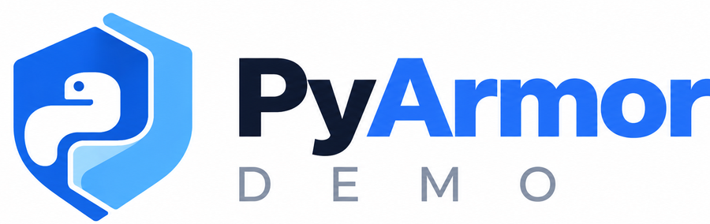

<p align="center">
  
</p>

<h1 align="center">Protect Python Applications</h1>

<p align="center">
  A hands-on lab for Python code obfuscation, runtime protection, packaging, and deployment,<br>
  and for understanding the real security boundary of protected Python software.
</p>

<p align="center">
  <a href="https://github.com/jars-demo/pyarmor-demo/actions/workflows/ci.yml"></a>
  
  
  
  
  <a href="LICENSE"></a>
</p>

<p align="center">
  <b>Live site:</b> <a href="https://pyarmor.jishanahmed.in">pyarmor.jishanahmed.in</a> ·
  <b>Repository:</b> <a href="https://github.com/jars-demo/pyarmor-demo">github.com/jars-demo/pyarmor-demo</a>
</p>

You take a small FastAPI app whose business logic is worth protecting, read it, obfuscate it with
PyArmor, prove it still behaves exactly the same, ship it in a Docker image that contains no
source, and then look at it the way an attacker would, to see what obfuscation does and does not
protect.

- **13 chapters, about 3 hours**, every command explained (what it does, why, what you should see)
- **Verified, not guessed**: every command and output was run with PyArmor 9.2.7 on Python 3.12
- **A real app**: FastAPI backend + Next.js website, one `docker compose up`
- **Honest about security**: obfuscation raises the effort to read your code; it is not encryption,
  DRM, or a substitute for protecting the machine it runs on

```text
SOURCE  →  OBFUSCATE  →  PROTECTED BUILD  →  DOCKER  →  DEPLOY
app/backend   pyarmor gen -r   build/protected   no source inside   HTTPS behind a proxy
```

## Get started

You need [Docker](https://docs.docker.com/get-docker/) and [Git](https://git-scm.com/downloads).

```bash
git clone https://github.com/jars-demo/pyarmor-demo.git
cd pyarmor-demo
docker compose up -d --build
```

| URL | What |
|---|---|
| <http://localhost:3300> | The workshop website, with a live **Lab** that calls your protected API |
| <http://localhost:8300/docs> | The protected API (Swagger UI) |

The build obfuscates the API inside Docker, so you do not need Python or PyArmor on your machine
for this. To follow the workshop step by step, you also need [uv](https://docs.astral.sh/uv/).

## What you'll learn

| | |
|---|---|
| Why Python source and bytecode expose your logic | How `pyarmor gen` protects scripts and packages |
| What the PyArmor runtime is, and three ways to break it | Build expiry (`-e`) and device binding (`-b`) |
| How to prove a protected build behaves identically | Packaging: archives and PyInstaller bundles |
| A two-stage Docker image with no source inside | Inspecting an image like the person who receives it |
| Deployment behind a reverse proxy with HTTPS | Where obfuscation stops, and what protects you beyond it |

## The workshop

| Chapter | You will | Time |
|---|---|---|
| [00 · Introduction](workshop/00-introduction.md) | Learn what code protection is, and the three-scenario threat model | 10 min |
| [01 · Project setup](workshop/01-project-setup.md) | Clone, install with uv, run the tests | 10 min |
| [02 · Explore the source](workshop/02-explore-source.md) | Read the app and find the logic worth protecting | 10 min |
| [03 · Baseline app](workshop/03-baseline-app.md) | Call every endpoint, record the answers | 10 min |
| [04 · Install PyArmor](workshop/04-pyarmor-setup.md) | Version, CLI, trial limits, licensing | 5 min |
| [05 · Obfuscation](workshop/05-obfuscation.md) | Protect a script, then the package; run and verify it | 15 min |
| [06 · Runtime](workshop/06-runtime.md) | Break the runtime three ways; expiry and device binding | 15 min |
| [07 · Original vs protected](workshop/07-compare.md) | What changed, what did not, and why it still works | 15 min |
| [08 · Packaging](workshop/08-packaging.md) | Archives and a PyInstaller bundle | 15 min |
| [09 · Docker](workshop/09-docker.md) | Build the image, then inspect it | 20 min |
| [10 · Deployment](workshop/10-deployment.md) | Reverse proxy, HTTPS, health checks, logs | 15 min |
| [11 · Security reality check](workshop/11-security-reality.md) | What obfuscation protects, and what it cannot | 15 min |
| [12 · Best practices](workshop/12-best-practices.md) | The production checklist | 15 min |

The same chapters, with copy buttons and progress tracking, are on
[pyarmor.jishanahmed.in](https://pyarmor.jishanahmed.in/workshop/).

## Why Python obfuscation?

Python ships as source. Anyone who receives your app can read every function and constant, and
shipping only `.pyc` files does not help, because bytecode decompiles. When your product runs on
machines you do not control (on-premises installs, desktop tools, containers shipped to partners),
[PyArmor](https://pyarmor.readthedocs.io/) makes that code much harder to read and reuse: each
module becomes a stub plus an encrypted payload that a compiled runtime decodes in memory.

## Architecture

```text
Developer → Python source (app/backend) → PyArmor build ─┬─ protected app  (build/protected/app)
                                                          └─ runtime        (pyarmor_runtime_000000)
          → Docker image (no source, no PyArmor) → deployment (proxy + HTTPS) → FastAPI → client
```

| Path | What |
|---|---|
| `app/backend/` | The FastAPI service. `business_logic/` is the code worth protecting |
| `app/frontend/` | The workshop website (Next.js, static export); its Lab calls the API |
| `scripts/` | `obfuscate.py`, `verify.py`, `smoke.py`, `runtime_view.py`, `gen_playground.py` |
| `workshop/` | The 13 chapters (also rendered by the website) |
| `deploy/` | A template for your own server: Caddy, HTTPS, health checks |

The interactive version is on the [architecture page](https://pyarmor.jishanahmed.in/architecture/).

## Run locally

Without Docker, with [uv](https://docs.astral.sh/uv/):

```bash
uv sync                                    # Python 3.12, deps, PyArmor 9.2.7 → .venv/
uv run pytest                              # 38 tests against the original source
uv run python -m app                       # API → http://127.0.0.1:8300
cd app/frontend && npm install && npm run dev   # website → http://localhost:3300 (calls :8300)
```

Without uv: `python -m venv .venv`, activate it, then
`pip install --require-hashes -r requirements.txt` and
`pip install pytest==9.1.1 httpx==0.28.1 ruff==0.16.10 pyarmor==9.2.7`.

## Obfuscate the application

```bash
uv run python scripts/obfuscate.py         # pyarmor gen -O build/protected -r --exclude app/frontend app
uv run python scripts/verify.py --tests    # obfuscated? runtime present? no plain names? same 38 tests?
```

`obfuscate.py` exists because **PyArmor 9.2.7 exits with status 0 even when it refuses to
obfuscate** (`ERROR out of license`); the script reads the log and fails properly.
[Chapter 05](workshop/05-obfuscation.md) runs the raw commands first.

## Run the protected application

```bash
cd build/protected
uv run python -m app                                   # in one terminal
uv run python scripts/smoke.py --expect-build protected   # from the repo root, in another
```

`GET /api/info` reports `"build": "protected"`, and every answer matches the original.

## Docker

```bash
docker compose up -d --build       # api (protected, :8300) + web (:3300)
docker compose ps                  # api: Up (healthy)
docker run --rm --entrypoint find pyarmor-demo:local /srv/app -type f   # obfuscated files + runtime only
docker compose down
```

The [API image](app/backend/Dockerfile) has two stages: the builder installs PyArmor, obfuscates and
verifies; the runtime image receives only the protected build and hash-checked dependencies. It
runs as a non-root user, with root-owned code, and compose adds a read-only filesystem, no Linux
capabilities and `no-new-privileges`. [Chapter 09](workshop/09-docker.md) inspects the result.

## Security model

| Scenario | The attacker has | What obfuscation does |
|---|---|---|
| A · Source available | your repository or plain `.py` files | nothing: everything is readable |
| B · Protected artifact | the obfuscated app and runtime | **raises the effort** to read and reuse your logic |
| C · Environment controlled | shell, files, processes, logs, env vars, network | **not the boundary**: protect the environment |

> If an attacker controls the machine where software executes, no Python obfuscator should be
> presented as an absolute security boundary.

## Limitations

- **Not encryption, not DRM.** Code must be decoded to run, so what is needed to run it ships with
  it. Expiry and device binding are enforced on a machine the user controls.
- **Runtime values stay visible.** Once loaded, a protected module's constants, names and docstrings
  can be read with ordinary introspection (`scripts/runtime_view.py` shows it; `--private` blocks
  that one route). Never put secrets in code.
- **Behaviour is observable.** Inputs, outputs, logs and timing reveal what the code does.
- **Builds are platform-specific.** A build runs only on the OS, CPU architecture and Python minor
  version that made it (3.12 here).
- **Trial limits.** The free PyArmor trial refuses large modules, has no `--mix-str`, BCC or RFT,
  and **is not for commercial products that earn real money**. Read the
  [license terms](https://pyarmor.readthedocs.io/en/latest/licenses.html).

## Production considerations

Secrets in a secrets manager, never in code or images; least privilege and hardened containers;
pinned, hash-checked, scanned dependencies; an SBOM; signed images and releases; CI-built
artifacts; strict server access. All of it is in [chapter 12](workshop/12-best-practices.md).

## Project structure

```text
pyarmor-demo/
├── app/
│   ├── __main__.py           python -m app → the API
│   ├── backend/              FastAPI service · Dockerfile (+ .dockerignore)
│   └── frontend/             Next.js website · Dockerfile, nginx.conf
├── scripts/                  obfuscate · verify · smoke · runtime_view · gen_playground
├── tests/                    pytest suite (runs on the original and the protected build)
├── workshop/                 chapters 00–12
├── examples/playground/      sources for the website's before/after Playground
├── deploy/                   server template: Caddy + HTTPS
├── docs/CHANGELOG.md
├── docker-compose.yml        api + web, hardened, localhost only
├── pyproject.toml · uv.lock · requirements.txt (hash-pinned)
├── run_api.py                entry script for PyInstaller bundles (chapter 08)
├── README.md · AGENTS.md · LICENSE
└── .github/workflows/ci.yml
```

## Testing

```bash
uv run pytest                                  # original source
uv run python scripts/verify.py --tests        # protected build: same suite, must pass identically
uv run python scripts/smoke.py --expect-build protected   # any running instance, over HTTP
cd app/frontend && npm run lint && npm run typecheck && npm run build
```

The tests cover every endpoint, the business logic with golden results, invalid input, CORS, and
which build is loaded.

## CI/CD

[`ci.yml`](.github/workflows/ci.yml) runs on every push and pull request, with read-only
permissions and every action pinned to a commit SHA:

1. **Backend**: ruff → `requirements.txt` matches `uv.lock` → pytest → PyArmor → verify +
   protected tests → HTTP smoke test → `pip-audit`
2. **Docker**: `docker compose up --build --wait` → smoke tests (API and through the site's proxy) →
   assert no source, no PyArmor, non-root, every module obfuscated → SPDX SBOM → Trivy scan
3. **Frontend**: lint → typecheck → static build → full build

No secrets are needed: CI uses the PyArmor trial within its free CI limits. To use a paid license,
see [AGENTS.md](AGENTS.md#pyarmor-licenses).

## Contributing

Fixes, clearer explanations and better examples are welcome. For anything bigger than a small fix,
open an issue first.

1. Fork, then create a branch.
2. Make the change. Code and docs move together: a changed command means updated chapter text and
   expected output.
3. Run the checks from [Testing](#testing). If you changed `app/backend` or an example, regenerate the
   Playground data: `uv run python scripts/gen_playground.py`.
4. Commit with [Conventional Commits](https://www.conventionalcommits.org/)
   (`type(scope): Imperative summary`) and open a pull request.

Never commit `.env`, `build/`, `dist/`, `node_modules/`, keys, or a PyArmor license file.
Agents: read [AGENTS.md](AGENTS.md).

pyarmor-demo is a community workshop. It is not an official PyArmor or Dashingsoft project and is
not endorsed by them. PyArmor is a product of Dashingsoft, used here under its free trial terms.

## License

[MIT](LICENSE) © 2026 Jishanahmed AR Shaikh. Part of [JARS Demo](https://github.com/jars-demo) ·
[JARS Skills](https://github.com/jars-demo/jars-skills) · [skills.jishanahmed.in](https://skills.jishanahmed.in)
